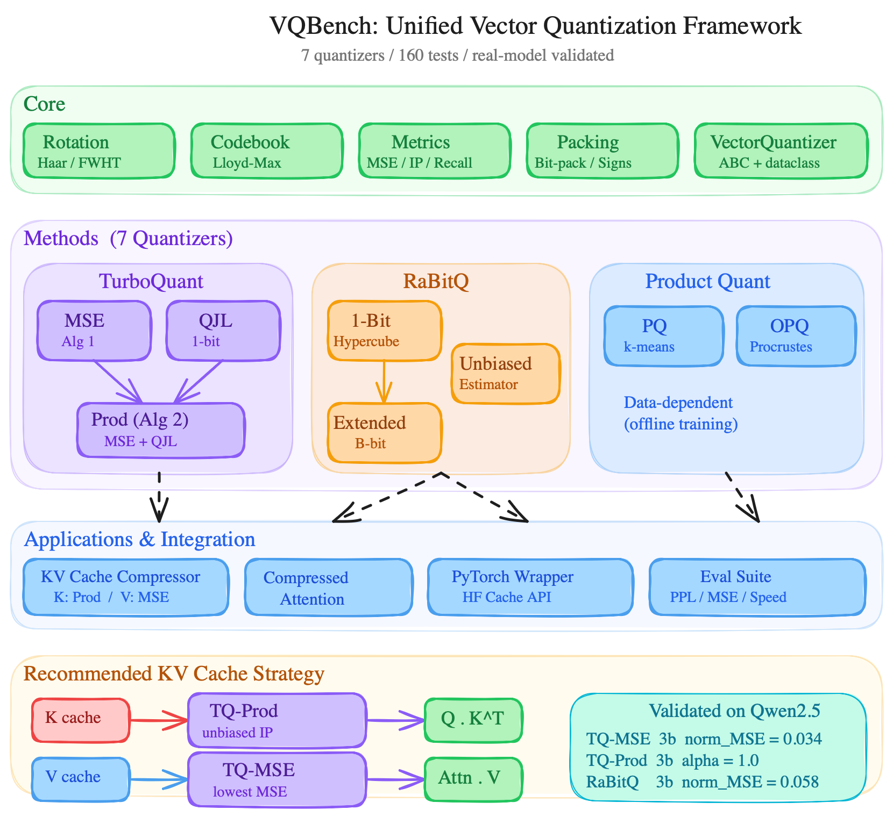

# VQBench — Implementation Report

> 2026-04-08 · Phase 1–9.0 Complete

---

## 1. Executive Summary

VQBench implements **7 vector quantizers** under a unified API and validates them on both synthetic unit-vector data and real-model K-cache tensors. The current results support a key benchmark insight:

- **Low reconstruction error alone is not sufficient to predict K-cache quality.**
- For **keys**, preserving inner products is more important than minimizing MSE.
- For **values**, MSE remains the right objective.

This points to an **asymmetric K/V strategy**: use an IP-faithful method for **K** and an MSE-oriented method for **V**. The current monkey-patched perplexity evaluation is overly pessimistic because it also quantizes current-token keys, so the next critical step is a **faithful autoregressive cache-based evaluation path**.

---

## 2. What We Built

A unified vector quantization benchmark framework with evaluation infrastructure, KV-cache compression, PyTorch/HuggingFace integration, and real-model validation.

### Package Structure (46 Python files, ~4500 LOC)

```
vqbench/
├── core/           base.py, rotation.py, metrics.py, packing.py
├── methods/
│   ├── turboquant/ codebook.py, mse.py, qjl.py, prod.py
│   ├── rabitq/     rabitq_1bit.py, rabitq_ext.py, estimator.py
│   └── pq/         product_quant.py, opq.py
├── eval/           distortion.py, bias.py, recall.py, speed.py, compression.py
├── kv_cache/       compressor.py, attention.py, outlier.py
├── torch_wrapper/  module.py, hook.py
├── validation/     ppl_eval.py, monkey_patch.py, k_mse.py, run_quick.py
├── datasets/       synthetic.py, wikitext.py
└── tests/          11 test files, 160 passing tests
```



### Implementation Phases

| Phase | What | Status |
|-------|------|--------|
| 1 | Core framework (ABC, Haar rotation, metrics) | ✅ |
| 2 | TurboQuant (Lloyd-Max codebook, MSE, QJL, Prod) | ✅ |
| 3 | RaBitQ (1-bit hypercube, ExtRaBitQ, unbiased estimator) | ✅ |
| 4 | PQ / OPQ (k-means codebook, Procrustes rotation) | ✅ |
| 5 | Unified evaluation + interface/fairness tests | ✅ |
| 6 | KV-cache compressor + compressed attention | ✅ |
| 7 | Performance: vectorized FWHT, bit packing, batch ops, rotation cache | ✅ |
| 8 | PyTorch wrapper + HuggingFace transformers `Cache` integration | ✅ |
| 9.0 | Norm correction (turboquant_plus parity) + real-model validation | ✅ |

---

## 3. Key Numerical Results

These tables report the current benchmark measurements for the present implementation and evaluation setup. They capture the observed trends clearly, but we do **not** yet report multi-seed variance or confidence intervals.

### 3.1 Normalized MSE on Synthetic Unit Vectors ($d = 512$)

Normalized MSE is defined as $\mathbb{E}\bigl[\lVert x - \tilde{x} \rVert^2 / \lVert x \rVert^2\bigr]$. The synthetic results closely match the predicted distortion-rate trends; the theoretical lower bound is $4^{-b}$.

| $b$ | TQ-MSE | TQ-Prod | RaBitQ | Lower Bound $4^{-b}$ |
|-----|--------|---------|--------|----------------------|
| 1 | **0.363** | 1.57 (IP) | 0.41 | 0.25 |
| 2 | **0.117** | 0.56 (IP) | ~0.13 | 0.0625 |
| 3 | **0.034** | 0.18 (IP) | ~0.04 | 0.0156 |
| 4 | **0.009** | 0.047 (IP) | ~0.012 | 0.0039 |

### 3.2 Normalized K-cache MSE on Real Model (Qwen2.5-1.5B, $d_\text{head} = 128$, WikiText-2)

| Method | 2-bit | 3-bit | 4-bit |
|--------|-------|-------|-------|
| **TQ-MSE** | **0.119** | **0.034** | **0.009** |
| TQ-Prod | 0.630 | 0.186 | 0.053 |
| RaBitQ | 0.265 | 0.058 | 0.013 |

### 3.3 Inner-Product Bias Factor (Expectation Form)

We fit $\alpha$ in the relation

$$\mathbb{E}\bigl[\langle y, \tilde{x} \rangle\bigr] = \alpha \cdot \langle y, x \rangle$$

With norm correction enabled (production setting):

| $b$ | TQ-MSE | TQ-Prod | RaBitQ |
|-----|--------|---------|--------|
| 1 | 0.803 | **1.0** | **1.0** |
| 2 | 0.928 | **1.0** | **1.0** |
| 3 | 0.977 | **1.0** | **1.0** |
| 4 | 0.996 | **1.0** | **1.0** |

---

## 4. Interpretation

### 4.1 Best Reconstruction Error Does Not Automatically Mean Best K-cache Quality

Under the assumptions of TurboQuant Theorem 1, and **without** norm correction, TQ-MSE is MSE-optimal among the scalar quantizers considered there. But K-cache compression is not judged directly by reconstruction error. Attention depends on

$$\mathrm{Attn}(Q, K, V) \;=\; \mathrm{softmax}\!\left(\frac{Q K^{\top}}{\sqrt{d}}\right) V$$

so for **keys**, the central object is the quality of the induced **inner products** $\langle q, k \rangle$, not the Euclidean reconstruction error $\lVert k - \tilde{k} \rVert$.

This is the core benchmark finding:

- **TQ-MSE wins on reconstruction MSE**
- **TQ-Prod and RaBitQ win on inner-product unbiasedness**

That is not a contradiction. It is a **metric-task mismatch**.

### 4.2 K and V Should Be Evaluated Differently

Keys and values play different roles in attention:

- **K cache** affects attention logits through inner products.
- **V cache** is consumed through a linear weighted sum, so reconstruction fidelity is the more natural objective.

This suggests an asymmetric interpretation of the current results:

- For **K**, IP fidelity is the critical metric.
- For **V**, MSE is still the right metric.

This is why a method can look dominant under MSE while still being less compelling for K-cache than its raw reconstruction numbers suggest.

### 4.3 TQ-MSE Shrinks Attention Logits in Expectation

TQ-MSE remains biased in the inner-product sense:

- At 3-bit, $\alpha \approx 0.977$
- At 4-bit, $\alpha \approx 0.996$

So the precise statement is:

- **In expectation**, attention logits are multiplicatively shrunk by $\alpha$, i.e. $\mathbb{E}[\langle q, \tilde{k} \rangle] = \alpha \cdot \langle q, k \rangle$ with $\alpha < 1$
- This can flatten the attention distribution after softmax

TQ-Prod and RaBitQ remove this multiplicative bias ($\alpha = 1$) by construction, but they do so with different reconstruction costs.

### 4.4 The RaBitQ Gap Narrows at Higher Bits

| $b$ | TQ-MSE | RaBitQ | TQ-MSE advantage |
|-----|--------|--------|-----------------|
| 2 | 0.119 | 0.265 | $2.2\times$ better |
| 3 | 0.034 | 0.058 | $1.7\times$ better |
| 4 | 0.009 | 0.013 | $1.4\times$ better |

At higher bit-widths, TQ-MSE still has the best MSE, but the gap narrows materially. This suggests that, for **K-cache**, eliminating systematic IP bias may matter more than the remaining MSE gap, especially at practical bit-widths such as 4-bit.

That is still a **hypothesis supported by current evidence**, not a finalized end-to-end conclusion. To validate it, we need faithful autoregressive cache-based evaluation.

### 4.5 Norm Correction Changes the Object Being Compared

Adding norm correction, to match `turboquant_plus` production behavior:

- improves IP bias substantially at low bits
- slightly worsens MSE at low bits
- has little MSE impact at $b \geq 3$ while still improving $\alpha$

This means the production TQ-MSE variant is no longer exactly the theorem's object. It is a practical compromise between reconstruction fidelity and IP behavior, which is the right engineering choice, but it narrows how strongly we should phrase the pure optimality claim.

### 4.6 RaBitQ Is a Strong Practical Baseline

| Aspect | TQ-MSE | TQ-Prod | RaBitQ |
|--------|--------|---------|--------|
| MSE | **Best** | Worst | Middle |
| IP bias | Biased | Unbiased | Unbiased |
| Metadata overhead | 16 bits | 32 bits | 64 bits |
| Simplicity | Simple | Complex (2-stage) | Simple |
| IP estimation | Direct (biased) | QJL correction | `ip_coeff` correction |

Our current results suggest that RaBitQ is a stronger practical baseline than a pure MSE-only comparison would imply:

- it preserves unbiased inner products
- it stays much closer to TQ-MSE in MSE at higher bits
- it achieves this with a relatively simple correction mechanism

What is still missing is a unified end-to-end accounting of **effective storage cost**, including metadata, rather than comparing only nominal bit-widths.

### 4.7 The Main Remaining Risk Is Evaluation Methodology

The current monkey-patching PPL evaluation gives catastrophic perplexity numbers, but the setup is not faithful to real KV-cache compression.

In the current path:

- the model's **current-token** key is also quantized
- all token positions are perturbed through the same injected `quantize -> dequantize` path

In real autoregressive KV-cache compression:

- the **current token** is exact
- only **past cached tokens** are quantized
- distant-token errors are weighted through the actual attention pattern

So the current PPL results are best interpreted as an overly pessimistic stress test, not as the true downstream quality of cache compression.

---

## 5. Comparison with `turboquant_plus`

Cross-validated against `turboquant_plus` as the reference implementation:

| Aspect | VQBench | turboquant_plus |
|--------|---------|----------------|
| **TQ-MSE output** | Identical (max diff = 1e-6) | Reference |
| **Codebook centroids** | Match to 7 sig figs | Reference |
| **Rotation matrices** | Identical for same seed | Reference |
| **Norm correction** | ✅ Added (production parity) | Default True |
| **RaBitQ** | ✅ Full implementation + estimator | Not implemented |
| **PQ/OPQ** | ✅ Full implementation | Not implemented |
| **Evaluation** | 7 methods × unified metrics | TQ + partial RQ |
| **PyTorch integration** | transformers 5.5.0 Cache API | Monkey-patch only |

---

## 6. Next Critical Steps

The next phase is not just more engineering. It is about making the evaluation path faithfully match the actual deployment setting.

1. **Build an autoregressive cache evaluator**
   Process tokens one at a time, keep current-token KV exact, and quantize only the stored past cache.
2. **Add task-proxy metrics for K-cache**
   Report attention-logit correlation, top-k overlap, or rank preservation in addition to MSE.
3. **Account for metadata in a unified storage metric**
   Convert nominal bit-width plus side information into effective bits per vector or compression ratio.
4. **Add variance reporting**
   Include repeated runs or dataset slices so trend claims can be stated with uncertainty bounds.
5. **Evaluate the asymmetric K/V strategy directly**
   Test IP-faithful quantization for K and MSE-oriented quantization for V on Qwen and Gemma settings.

The current numerical results, together with the reference-implementation checks, give confidence that the quantizers themselves are implemented correctly. The key open problem is now **faithful downstream evaluation**.
